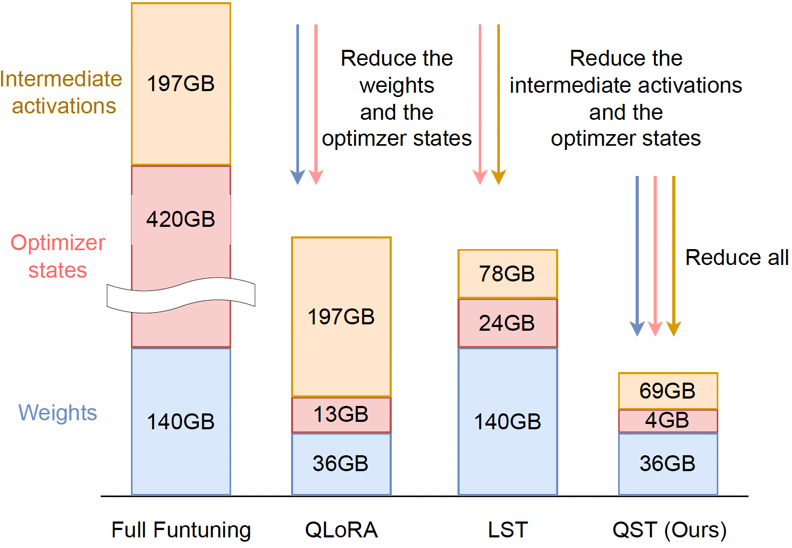
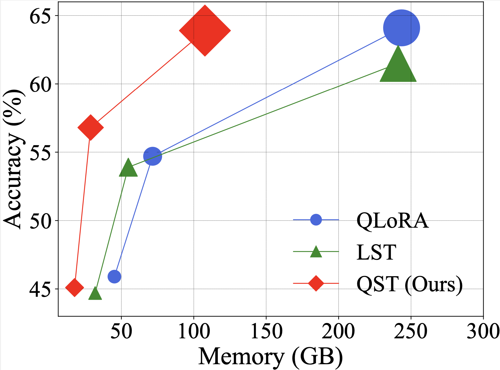
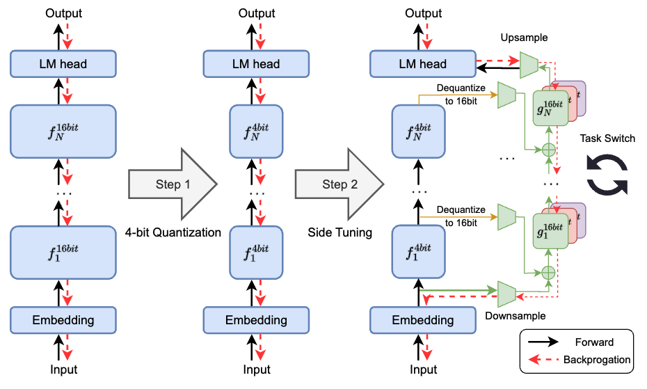

# Quantized Side Tuning: Fast and Memory-Efficient Tuning of Quantized Large Language Models

## Quick Start

- [Introduction](#introduction)
- [Features](#features)
- [Installation](#installation)
- [Usage](#usage)
- [Contributing](#contributing)
- [License](#license)
- [Acknowledgements](#acknowledgements)

## Introduction

Finetuning large language models (LLMs) has been empirically effective on a variety of downstream tasks. Existing approaches to finetuning an LLM either focus on parameter-efficient finetuning, which only updates a small number of trainable parameters, or attempt to reduce the memory footprint during the training phase of the finetuning. Typically, the memory footprint during finetuning stems from three contributors: model weights, optimizer states, and intermediate activations. However, existing works still require considerable memory and none can simultaneously mitigate memory footprint for all three sources. In this paper, we present Quantized Side Tuing (QST), which enables memory-efficient and fast finetuning of LLMs by operating through a dual-stage process. First, QST quantizes an LLM's model weights into 4-bit to reduce the memory footprint of the LLM's original weights; QST also introduces a side network separated from the LLM, which utilizes the hidden states of the LLM to make task-specific predictions. Using a separate side network avoids performing backpropagation through the LLM, thus reducing the memory requirement of the intermediate activations. Furthermore, QST leverages several low-rank adaptors and gradient-free downsample modules to significantly reduce the trainable parameters, so as to save the memory footprint of the optimizer states. 
Experiments show that QST can reduce the total memory footprint by up to 2.3 times and speed up the finetuning process by up to 3 times while achieving competent performance compared with the state-of-the-art. When it comes to full finetuning, QST can reduce the total memory footprint up to 7 times.
<p float="left">
  
   
</p>


## Features

- **Feature 1**: 4-bit Quantization.
- **Feature 2**: Side tuning.

## Installation

1. git clone the repo
   ```
   git clone https://github.com/YouAreSpecialToMe/QST.git
2. install requirements
   ```
   cd QST
   pip install -r requirements.txt
## Usage
1. Leverage the HuggingFace and bitsandbytes library to load the 4-bit pre-trained model
   ```
   model = AutoModelForCausalLM.from_pretrained(
        YourModelPath,
        load_in_4bit=True,
        device_map="auto",
        quantization_config=BitsAndBytesConfig(
            load_in_4bit=True,
            llm_int8_threshold=6.0,
            llm_int8_has_fp16_weight=False,
            bnb_4bit_compute_dtype=torch.bfloat16,
            bnb_4bit_use_double_quant=True,
            bnb_4bit_quant_type="nf4",
        ),
        torch_dtype=torch.bfloat16,
    )
2. Initialize the hyperparameters of the side network
   ```
   qst_config = QSTConfig(
        add_layer_norm_before_adapter=False,
        add_layer_norm_after_adapter=True,
        r=16,
        dropout=0.1,
        activation="swish",
        fan_in_fan_out=False,
        peft_hidden_size=16
    )
3. Initialize the QST model based on the 4-bit pre-trained model
   ```
   # Llama series
   model = QSTLlamaForCausalLM(model, config, qst_config)
   # OPT series
   model = QSTOPTForCausalLM(model, config, qst_config)
4. You can use the HuggingFace trainer or customer-defined training process based on Pytorch to finetune QST
    ```
    trainer = Trainer(
        model,
        ... # Other training args
    )
## Scripts
 You can use qst-70b.sh to finetune Llama-2-70b model. 
```
   bash qst-70b.sh
 ```
## Contributing
Anonymous.

## License
This project is licensed under the Apache License 2.0 - see the [LICENSE](LICENSE) file for details.
## Acknowlegement
This code is based on [QLoRA](https://github.com/artidoro/qlora), Standford [Alpaca](https://github.com/artidoro/qlora), and [FastChat](https://github.com/lm-sys/FastChat) repos.

